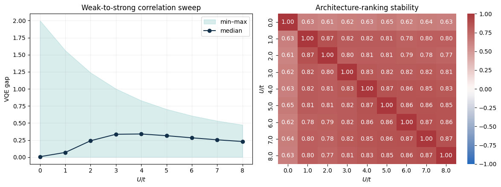
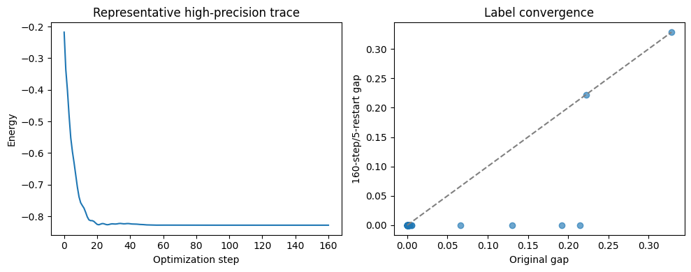

# Graph-Attention-QAS

Graph-Attention-QAS studies predictor-guided quantum architecture search (QAS) for
variational ground-state calculations. The current research suite extends the original
spin-model notebooks to physically motivated electronic-structure benchmarks:

- a half-filled two-site spinful Fermi–Hubbard model over a dense interaction sweep;
- six-qubit active-space LiH Hamiltonians over an equilibrium-to-stretched bond scan;
- circuit-only, pairwise-Hamiltonian, and lossless Pauli-factor graph encodings;
- trainable graph attention networks (GATs) with MLP and KAN regression heads;
- simultaneous transfer to unseen circuit architectures and unseen Hamiltonians.

The project is a small exact-simulation benchmark. It does **not** claim quantum
advantage, hardware-noise robustness, or large-system scalability.

## Current Kaggle experiment suite

The seven notebook templates in [`kaggle_notebooks/`](kaggle_notebooks/) are the
recommended entry point. Each embeds the complete shared implementation and can run in
a fresh Kaggle session without cloning the repository. Stored Kaggle executions and
their exported artifacts are under
[`Kaggle_QAS_Materials_Experiment_Suite/kaggle_notebooks/`](Kaggle_QAS_Materials_Experiment_Suite/kaggle_notebooks/).

| Order | Notebook | Purpose | Principal outputs |
|---:|---|---|---|
| 0 | [`00_build_hubbard_multiseed_dataset.ipynb`](kaggle_notebooks/00_build_hubbard_multiseed_dataset.ipynb) | Generate five disjoint architecture pools over $U/t=0,1,\ldots,8$; validate physics and factor-graph reconstruction | `hubbard_dense_multiseed.csv`, manifest |
| 1 | [`01_multiseed_bootstrap_statistics.ipynb`](kaggle_notebooks/01_multiseed_bootstrap_statistics.ipynb) | Repeat the unseen-architecture/unseen-$U/t$ experiment across five end-to-end seeds | per-seed Kendall $\tau$, mean, sample SD, bootstrap 95% CI |
| 2 | [`02_unseen_architecture_and_parameter_test.ipynb`](kaggle_notebooks/02_unseen_architecture_and_parameter_test.ipynb) | Separate parameter transfer, architecture transfer, and simultaneous transfer | factorial transfer table and plot |
| 3 | [`03_vqe_convergence_check.ipynb`](kaggle_notebooks/03_vqe_convergence_check.ipynb) | Re-evaluate leading Hubbard circuits using 160 steps and five restarts | convergence traces, leading-set rank stability, top-1 agreement |
| 4 | [`04_trainable_gat_kan_ablation.ipynb`](kaggle_notebooks/04_trainable_gat_kan_ablation.ipynb) | Compare scalar, circuit, pairwise, Pauli-factor, GAT, and KAN variants under one label budget | model-seed results and ablation summary |
| 5 | [`05_dense_hubbard_sweep_analysis.ipynb`](kaggle_notebooks/05_dense_hubbard_sweep_analysis.ipynb) | Analyze weak-to-strong correlation and architecture-rank crossovers | gap summary and $U/t$-by-$U/t$ rank-correlation matrix |
| 6 | [`06_lih_bond_length_transfer.ipynb`](kaggle_notebooks/06_lih_bond_length_transfer.ipynb) | Test unseen-architecture and unseen-geometry transfer for LiH | per-bond rankings, model comparison, molecular convergence audit |

Detailed execution instructions are in
[`kaggle_notebooks/README.md`](kaggle_notebooks/README.md). The theoretical consistency
record is in
[`kaggle_notebooks/THEORETICAL_AUDIT.md`](kaggle_notebooks/THEORETICAL_AUDIT.md).

## Running on Kaggle

1. Upload one notebook to Kaggle.
2. Enable Internet for the initial PennyLane installation if it is not already present.
3. Set `FAST_MODE = True` for a short pipeline check.
4. Set `FAST_MODE = False` before producing reportable results.
5. Save `/kaggle/working/qas_materials/` as a Kaggle Dataset and attach it to subsequent
   notebooks.

Publication mode is configured to generate:

- Hubbard: $24\times5\times9=1080$ base VQE labels;
- LiH: $18\times5\times9=810$ base VQE labels;
- base Hubbard labels: 60 Adam steps and two restarts;
- base LiH labels: 70 Adam steps and two restarts;
- convergence audits: 160 steps and five restarts.

Label generation checkpoints after every interaction or bond length. Quick-mode caches
have distinct `_fast.csv` filenames. Dataset schema
`2026-09-v3-pauli-factor-graph` rejects incompatible older caches.

## Executed results: notebooks 00–06

These values were read from the stored, full-mode Kaggle executions—not copied from
the notebook templates. Notebooks 00–06 completed every code cell without a stored
exception.

| Notebook | Execution status | Stored evidence |
|---:|---|---|
| 00 | Complete | [executed notebook](Kaggle_QAS_Materials_Experiment_Suite/kaggle_notebooks/00_build_hubbard_multiseed_dataset/00-build-hubbard-multiseed-dataset.ipynb), [dataset](Kaggle_QAS_Materials_Experiment_Suite/kaggle_notebooks/00_build_hubbard_multiseed_dataset/qas_materials/hubbard_dense_multiseed.csv), [manifest](Kaggle_QAS_Materials_Experiment_Suite/kaggle_notebooks/00_build_hubbard_multiseed_dataset/qas_materials/hubbard_dense_multiseed_manifest.json) |
| 01 | Complete | [executed notebook](Kaggle_QAS_Materials_Experiment_Suite/kaggle_notebooks/01_multiseed_bootstrap_statistics/01-multiseed-bootstrap-statistics.ipynb) |
| 02 | Complete | [executed notebook](Kaggle_QAS_Materials_Experiment_Suite/kaggle_notebooks/02-unseen-architecture-and-parameter-test/02-unseen-architecture-and-parameter-test.ipynb), [result table](Kaggle_QAS_Materials_Experiment_Suite/kaggle_notebooks/02-unseen-architecture-and-parameter-test/unseen_architecture_parameter_results.txt) |
| 03 | Complete | [executed notebook](Kaggle_QAS_Materials_Experiment_Suite/kaggle_notebooks/03_vqe_convergence_check/03-vqe-convergence-check.ipynb), [high-precision labels](Kaggle_QAS_Materials_Experiment_Suite/kaggle_notebooks/03_vqe_convergence_check/qas_materials/vqe_high_precision_check.csv), [stability table](Kaggle_QAS_Materials_Experiment_Suite/kaggle_notebooks/03_vqe_convergence_check/qas_materials/vqe_ranking_stability.csv) |
| 04 | Complete | [executed notebook](Kaggle_QAS_Materials_Experiment_Suite/kaggle_notebooks/04-trainable-gat-kan-ablation/04-trainable-gat-kan-ablation.ipynb) |
| 05 | Complete | [executed notebook](Kaggle_QAS_Materials_Experiment_Suite/kaggle_notebooks/05-dense-hubbard-sweep-analysis/05-dense-hubbard-sweep-analysis.ipynb), [gap summary](Kaggle_QAS_Materials_Experiment_Suite/kaggle_notebooks/05-dense-hubbard-sweep-analysis/qas_materials/dense_hubbard_gap_summary.csv), [rank matrix](Kaggle_QAS_Materials_Experiment_Suite/kaggle_notebooks/05-dense-hubbard-sweep-analysis/qas_materials/dense_hubbard_rank_correlation.csv) |
| 06 | Complete | [executed notebook](Kaggle_QAS_Materials_Experiment_Suite/kaggle_notebooks/06-lih-bond-length-transfer/06-lih-bond-length-transfer.ipynb), [dataset](<Kaggle_QAS_Materials_Experiment_Suite/kaggle_notebooks/06-lih-bond-length-transfer/results (1)/qas_materials/lih_bond_multiseed.csv>), [model summary](<Kaggle_QAS_Materials_Experiment_Suite/kaggle_notebooks/06-lih-bond-length-transfer/results (1)/qas_materials/lih_transfer_model_summary.csv>), [per-bond results](<Kaggle_QAS_Materials_Experiment_Suite/kaggle_notebooks/06-lih-bond-length-transfer/results (1)/qas_materials/lih_transfer_by_bond.csv>), [convergence audit](<Kaggle_QAS_Materials_Experiment_Suite/kaggle_notebooks/06-lih-bond-length-transfer/results (1)/qas_materials/lih_finalist_convergence_audit.csv>) |

The executed environment reported PennyLane 0.43.3, PyTorch 2.10.0+cu128, and a CUDA
device. The PennyLane warning about JAX 0.7.2 does not affect these runs because the VQE
QNodes use the Autograd interface.

### Dataset and representation checks

Notebook 00 produced exactly 1,080 unique rows: 120 distinct circuits, formed from 24
architectures for each of five architecture seeds, evaluated at nine interaction
values. Every label used 60 Adam steps and two restarts. The largest Pauli-factor-graph
round-trip coefficient error over the nine Hamiltonians was
$8.88\times10^{-16}$, well below the asserted $10^{-10}$ tolerance.

| $U/t$ | Best gap (Ha) | Median gap (Ha) | Mean gap (Ha) | Worst gap (Ha) |
|---:|---:|---:|---:|---:|
| 0 | 0.000011 | 0.006298 | 0.494556 | 2.000000 |
| 1 | 0.000092 | 0.068411 | 0.456405 | 1.561553 |
| 2 | 0.000050 | 0.239824 | 0.420117 | 1.236068 |
| 3 | 0.000019 | 0.334603 | 0.387149 | 1.000000 |
| 4 | 0.000002 | 0.338695 | 0.342756 | 0.828427 |
| 5 | 0.000100 | 0.313677 | 0.305507 | 0.701562 |
| 6 | 0.000022 | 0.282542 | 0.272621 | 0.605551 |
| 7 | 0.000066 | 0.253532 | 0.245753 | 0.531129 |
| 8 | 0.000047 | 0.228586 | 0.224644 | 0.472136 |

### Transfer tests

Notebook 02 used 432 training rows, 24 validation rows, and a 336-row union of the
three evaluation quadrants. Its single trained joint factor-GAT produced:

| Evaluation quadrant | Rows | Hamiltonians | Kendall $\tau_b$ | Spearman $\rho$ |
|---|---:|---:|---:|---:|
| Unseen $U/t$ only | 144 | 2 | 0.508 | 0.694 |
| Unseen architecture only | 144 | 6 | 0.534 | 0.744 |
| Both unseen | 48 | 2 | 0.569 | 0.770 |

Notebook 01 is the stronger uncertainty check because it repeats simultaneous transfer
across five independently generated architecture pools and training seeds:

| Architecture seed | Mean test $\tau_b$ | Minimum per-$U/t$ $\tau_b$ | Validation $\tau_b$ |
|---:|---:|---:|---:|
| 11 | 0.40 | 0.40 | 0.40 |
| 23 | -0.10 | -0.20 | 0.40 |
| 37 | 0.80 | 0.80 | 0.00 |
| 51 | -0.20 | -0.20 | 0.80 |
| 79 | 0.00 | 0.00 | 1.00 |

Across seeds, mean Kendall correlation was 0.18, sample SD was 0.415, and the seed-level
bootstrap 95 percent interval was $[-0.12,0.54]$. Because the interval includes zero
and the five results range from -0.20 to 0.80, the current execution does not establish
robust simultaneous-transfer performance. Notebook 02's 0.569 result is a useful
single-split result, not a substitute for the repeated-seed estimate.

### VQE convergence audit

Notebook 03 re-optimized 75 leading circuits with 160 Adam steps and five restarts. All
75 high-budget gaps were lower than their base-budget values. The median gap change was
$-5.37\times10^{-4}$ Ha; the mean was $-8.72\times10^{-3}$ Ha and the largest absolute
change was 0.214 Ha, showing a strongly skewed optimizer effect.

| $U/t$ | Five-seed mean leading-set $\tau_b$ | Top-1 agreement |
|---:|---:|---:|
| 0 | -0.04 | 0.00 |
| 4 | 0.32 | 0.80 |
| 8 | 0.36 | 0.40 |
| **Overall** | **0.213** | **0.40** |

The 60-step/two-restart labels are therefore adequate as exploratory labels but are not
converged enough to support a strong finalist-ranking claim. The principal experiments
should be repeated with higher-budget labels, or at minimum the reported conclusions
should be conditioned on this low ranking stability.

### Trainable-model ablation

Notebook 04 used the same 432/24/48 train/validation/test split for every model. Neural
rows report mean and sample SD over initialization seeds 101, 202, and 303.

| Model | Parameters | Mean test $\tau_b$ | SD |
|---|---:|---:|---:|
| Joint factor GAT + KAN | 19,368 | 0.546 | 0.081 |
| Circuit GAT | 9,985 | 0.535 | 0.052 |
| Joint factor GAT | 9,985 | 0.533 | 0.000 |
| Joint pairwise GAT | 9,985 | 0.519 | 0.049 |
| Depth/count ridge | 5 | 0.363 | — |

The factor graph exceeds the lossy pairwise mean by only 0.013 and does not exceed the
circuit-only mean. KAN has the highest mean but also twice the parameter count and the
largest SD. These results do not yet demonstrate a factor-graph or KAN advantage.

The Hamiltonian-only negative control is intentionally omitted from the performance
table. It has identical graph input for all circuits at fixed $H$, so its true
within-Hamiltonian ranking is undefined. The stored nonzero values
($-0.172,-0.103,0.082$) are inconsistent with that invariant and therefore indicate
numerical/batching tie breaking or an implementation defect; they must not be
interpreted as predictive performance.

### Dense interaction sweep

Architecture rankings are substantially more stable between adjacent interacting
Hamiltonians than between $U/t=0$ and $1$:

| Transition | Kendall $\tau_b$ |
|---|---:|
| 0 to 1 | 0.630 |
| 1 to 2 | 0.871 |
| 2 to 3 | 0.802 |
| 3 to 4 | 0.833 |
| 4 to 5 | 0.866 |
| 5 to 6 | 0.856 |
| 6 to 7 | 0.871 |
| 7 to 8 | 0.875 |

This supports an architecture-rank crossover near the noninteracting boundary, while
rankings change more smoothly through the interacting regime.

### LiH bond-length transfer

Notebook 06 completed the full six-qubit LiH experiment. It generated 810 labels from
18 circuits per architecture seed, five seeds, and nine bond lengths. Every label used
70 Adam steps and two restarts. The largest Pauli-factor-graph round-trip coefficient
error across the nine molecular Hamiltonians was $1.78\times10^{-15}$, below the
asserted $10^{-10}$ tolerance.

The simultaneous architecture-and-geometry split was:

| Split | Architecture seeds | Li–H distances (Å) | Rows used |
|---|---|---|---:|
| Train | 11, 23, 37 | 1.0, 1.4, 1.8, 2.4, 3.2 | 270 |
| Validation | 51 | 1.2 | 18 |
| Test | 79 | 1.6, 2.0, 2.8 | 54 |

The remaining rows in the complete 810-row label table are not part of these three
Cartesian subsets. Exact circuit fingerprints are disjoint across the architecture
split. All test correlations below are calculated within a bond length and then
macro-averaged over the three held-out geometries.

| Model | Validation Kendall $\tau_b$ | Epochs | Test Kendall $\tau_b$ | Test Spearman $\rho$ |
|---|---:|---:|---:|---:|
| Circuit GAT | 0.503 | 43 | **0.259** | **0.366** |
| Joint pairwise GAT | **0.569** | 134 | 0.203 | 0.306 |
| Joint factor GAT | 0.503 | 68 | 0.137 | 0.227 |
| Joint factor GAT + KAN | 0.556 | 54 | 0.233 | 0.362 |

Circuit GAT gives the highest macro test correlation in this stored run. The KAN head
improves the joint factor model and nearly matches the circuit-only Spearman result,
but neither Hamiltonian representation beats circuit GAT. Consequently, this LiH run
does not establish a Hamiltonian-encoding advantage.

The geometry-resolved results rank the same 18 unseen seed-79 circuits at every test
distance:

| Model | $R=1.6$ Å | $R=2.0$ Å | $R=2.8$ Å |
|---|---:|---:|---:|
| Circuit GAT | **0.190** | **0.229** | **0.359** |
| Joint pairwise GAT | 0.150 | 0.190 | 0.268 |
| Joint factor GAT | 0.085 | 0.098 | 0.229 |
| Joint factor GAT + KAN | 0.163 | 0.203 | 0.333 |

The label distribution also becomes substantially harder in the stretched regime:

| Li–H distance (Å) | Best gap (Ha) | Median gap (Ha) |
|---:|---:|---:|
| 1.0 | $8.276\times10^{-6}$ | $1.130\times10^{-3}$ |
| 1.2 | $1.003\times10^{-5}$ | $9.756\times10^{-4}$ |
| 1.4 | $1.085\times10^{-5}$ | $8.770\times10^{-4}$ |
| 1.6 | $1.682\times10^{-5}$ | $8.060\times10^{-4}$ |
| 1.8 | $2.719\times10^{-5}$ | $7.616\times10^{-4}$ |
| 2.0 | $4.932\times10^{-5}$ | $7.559\times10^{-4}$ |
| 2.4 | $2.095\times10^{-4}$ | $1.866\times10^{-3}$ |
| 2.8 | $1.126\times10^{-3}$ | $7.552\times10^{-3}$ |
| 3.2 | $1.236\times10^{-3}$ | $1.156\times10^{-2}$ |

The median circuit first exceeds the plotted 1.6 mHa active-space threshold at
$R=2.4$ Å, whereas the best circuit remains below it at every sampled geometry.

/__results___files/__results___9_0.png>)

The molecular convergence audit reran the three lowest-gap seed-79 circuits at each
test geometry with 160 steps and five restarts:

| Bond (Å) | Architecture | Base gap (Ha) | High-precision gap (Ha) |
|---:|---:|---:|---:|
| 1.6 | 79 / 12 | $3.329\times10^{-5}$ | $3.302\times10^{-5}$ |
| 1.6 | 79 / 5 | $2.279\times10^{-4}$ | $2.274\times10^{-4}$ |
| 1.6 | 79 / 4 | $2.281\times10^{-4}$ | $2.274\times10^{-4}$ |
| 2.0 | 79 / 12 | $1.014\times10^{-4}$ | $1.010\times10^{-4}$ |
| 2.0 | 79 / 5 | $5.792\times10^{-4}$ | $5.787\times10^{-4}$ |
| 2.0 | 79 / 4 | $5.794\times10^{-4}$ | $5.787\times10^{-4}$ |
| 2.8 | 79 / 9 | $1.747\times10^{-3}$ | $1.745\times10^{-3}$ |
| 2.8 | 79 / 12 | $2.764\times10^{-3}$ | $2.761\times10^{-3}$ |
| 2.8 | 79 / 6 | $3.256\times10^{-3}$ | $3.256\times10^{-3}$ |

All nine high-precision gaps are lower than their base values. The largest absolute
change is $3.13\times10^{-6}$ Ha, so the selected molecular finalists are stable under
the larger optimization budget. This is markedly better convergence behavior than the
stored Hubbard finalist audit, although it covers only the selected LiH circuits.

## 1. Scientific objective

For a Hamiltonian $H_\lambda$ parameterized by an interaction, geometry, or material
condition $\lambda$, a variational circuit architecture $a$ defines

$$
|\psi_a(\boldsymbol\theta)\rangle
=U_a(\boldsymbol\theta)|\phi_0\rangle .
$$

The inner VQE problem is

$$
E_a^{\star}(\lambda)
=\min_{\boldsymbol\theta}
\langle\psi_a(\boldsymbol\theta)|H_\lambda|\psi_a(\boldsymbol\theta)\rangle,
$$

and QAS seeks

$$
a^{\star}(\lambda)=\arg\min_{a\in\mathcal A}E_a^{\star}(\lambda).
$$

Because fully optimizing every $a\in\mathcal A$ is expensive, a learned surrogate
$s_\phi(a,H_\lambda)$ ranks candidate circuits. Only a small finalist set is sent to
high-precision VQE.

The central experimental question is whether encoding both the circuit and the
Hamiltonian improves ranking when either or both are unseen during training.

## 2. Physical Hamiltonians

### 2.1 Two-site spinful Fermi–Hubbard model

With hopping $t>0$, onsite interaction $U\geq0$, site $i\in\{0,1\}$, and spin
$\sigma\in\{\uparrow,\downarrow\}$,

$$
H_{\mathrm{Hub}}
=-t\sum_{\sigma}
\left(c_{0\sigma}^{\dagger}c_{1\sigma}
+c_{1\sigma}^{\dagger}c_{0\sigma}\right)
+U\sum_{i=0}^{1}n_{i\uparrow}n_{i\downarrow}.
$$

Spin orbitals are ordered

$$
(0\uparrow,1\uparrow,0\downarrow,1\downarrow).
$$

For adjacent orbitals under Jordan–Wigner,

$$
c_p^\dagger c_q+c_q^\dagger c_p
\mapsto \frac{1}{2}(X_pX_q+Y_pY_q),
n_p=\frac{I-Z_p}{2}.
$$

The implemented four-qubit Hamiltonian is consequently

$$
\begin{aligned}
H_{\mathrm{Hub}}
={}&-\frac{t}{2}(X_0X_1+Y_0Y_1+X_2X_3+Y_2Y_3)\\
&+\frac{U}{4}
\sum_{(p,q)\in\{(0,2),(1,3)\}}
(I-Z_p-Z_q+Z_pZ_q).
\end{aligned}
$$

All calculations remain in the half-filled $N=2$ sector. For $t=1$, the exact
two-site singlet ground energy is used as a unit test:

$$
E_0(U)=\frac{U-\sqrt{U^2+16}}{2}.
$$

The dense benchmark uses

$$
U/t\in\{0,1,2,3,4,5,6,7,8\}.
$$

### 2.2 LiH electronic structure

In second quantization, the molecular electronic Hamiltonian is

$$
H_{\mathrm{el}}(R)
=\sum_{pq}h_{pq}(R)a_p^\dagger a_q
+\frac12\sum_{pqrs}h_{pqrs}(R)
a_p^\dagger a_q^\dagger a_r a_s
+E_{\mathrm{nuc}}(R),
$$

where $R$ is the Li–H distance. The notebook uses STO-3G, freezes the Li core, and
retains two active electrons in three spatial orbitals, giving six spin orbitals and six
qubits. Jordan–Wigner produces

$$
H_{\mathrm{LiH}}(R)=\sum_{k=1}^{M(R)}c_k(R)P_k,
P_k\in\{I,X,Y,Z\}^{\otimes6}.
$$

The geometry grid is

$$
R(\mathrm{Angstrom})\in\{1.0,1.2,1.4,1.6,1.8,2.0,2.4,2.8,3.2\}.
$$

Exact diagonalization is restricted to the same two-electron active-space sector:

$$
E_0^{(N=2)}(R)
=\lambda_{\min}\left(H_{\mathrm{LiH}}(R)\vert_{N=2}\right).
$$

This reference is used only for evaluation. It is not supplied to the surrogate.

## 3. Particle-number-preserving circuit space

Every architecture is an ordered sequence of parameterized PennyLane
`SingleExcitation` and `DoubleExcitation` gates:

$$
U_a(\boldsymbol\theta)
=G_{a,L_a}(\theta_{L_a})\cdots G_{a,2}(\theta_2)G_{a,1}(\theta_1),
G_{a,\ell}\in\{S_{pq},D_{pqrs}\}.
$$

Both operations preserve Hamming weight, so a two-electron reference remains in the
$N=2$ sector. Circuit depths are sampled from

$$
L_a\in\{3,4,5,6,7,8\}.
$$

Every sampled circuit begins with an excitation that acts non-trivially on the
reference. Architecture pools are independently seeded and then explicitly
de-duplicated. A circuit fingerprint is its complete ordered gate-and-wire sequence.
No fingerprint may cross an architecture-held-out split.

For a fixed architecture, identical random initial angles are reused across all
$U/t$ values or all bond lengths. This common-random-number design reduces the
optimizer-noise contribution to apparent Hamiltonian-transfer effects.

## 4. VQE labels and convergence audit

For restart $r$, parameters begin at

$$
\theta_{\ell}^{(0,r)}\sim\mathcal N(0,0.08^2)
$$

and are optimized using Adam with learning rate $0.10$. The stored label is

$$
\widehat E_a(\lambda)
=\min_{r\in\{1,\ldots,R_{\mathrm{VQE}}\}}
E_a\left(\boldsymbol\theta_{a,r}^{(T)};\lambda\right).
$$

The reporting gap is

$$
\Delta E_a(\lambda)=\widehat E_a(\lambda)-E_0(\lambda)\geq0.
$$

The variational inequality is asserted numerically. Exact energies are used for this
gap and for diagnostics only.

Notebook 03 re-optimizes the five lowest-gap circuits for each architecture seed at
$U/t\in\{0,4,8\}$ with $T=160$ and $R_{\mathrm{VQE}}=5$. It reports

$$
\tau_{\mathrm{conv}}
=\tau_b(\Delta E^{\mathrm{base}},\Delta E^{\mathrm{high}})
$$

within each selected leading set, together with top-1 agreement. This is not claimed to
measure convergence across the entire architecture distribution. Notebook 06 performs
an analogous high-precision audit for selected LiH finalists.

## 5. Circuit graph

For architecture $a$, the circuit graph

$$
\mathcal G_C(a)=(\mathcal V_C,\mathcal E_C)
$$

contains one node per excitation. Circuit-node features include

$$
x_\ell^{(C)}=
\left[
\mathrm{type}(G_\ell),
\ell/(L_a-1),
L_a/10,
\mathrm{wiremask}(G_\ell)
\right].
$$

Two operation nodes are connected when they are consecutive or act on at least one
common spin orbital. Self-loops are included. Node position preserves ordered-circuit
information even though message-passing edges are bidirectional.

## 6. Lossless Pauli-term factor graph

### 6.1 Why a pairwise qubit graph is insufficient

A clique projection connects every pair of qubits appearing in one Pauli word. For
example,

$$
cX_0Z_1Z_2X_3
$$

becomes six weighted qubit-pair edges. Those edges do not record that all four factors
belong to one operator, and they may be indistinguishable from several separate
two-qubit terms. The legacy pairwise ablation uses

$$
w_{ij}=\sum_{k:i,j\in\mathrm{supp}(P_k)}
\frac{|c_k|}{S_H},
S_H=\max\left(1,\sum_k|c_k|\right),
$$

which is useful as a baseline but is not reconstructible.

### 6.2 Factor-graph construction

Duplicate Pauli strings are first aggregated:

$$
\widetilde c(P)=\sum_{k:P_k=P}c_k.
$$

The Hamiltonian factor graph is bipartite:

$$
\mathcal G_H=(\mathcal V_Q\cup\mathcal V_P\cup\{v_H\},\mathcal E_H),
$$

where

- $\mathcal V_Q$ contains one node for each qubit;
- $\mathcal V_P$ contains one node for each non-identity Pauli word;
- $v_H$ is a global node containing the identity coefficient and overall scale.

For Pauli term $P_k$, its term-node features include

$$
x_k^{(P)}=
\left[
\frac{c_k}{S_H},
\frac{|c_k|}{S_H},
\frac{\log(1+|c_k|)}{\log(1+S_H)},
\frac{|\mathrm{supp}(P_k)|}{n},
f_X,f_Y,f_Z
\right],
$$

where $(f_X,f_Y,f_Z)$ are the fractions of non-identity factors of each axis. The global
node stores the following physics-specific entries:

$$
x_H^{(G)}=
\left[\log(1+S_H),\frac{c_I}{S_H}\right].
$$

The full node vector also contains its node-type indicator and zero padding to the
shared 24-dimensional feature width.

A term node $v_{P_k}$ connects to qubit $v_{q_i}$ exactly when
$P_k^{(i)}\neq I$. Its edge feature is

$$
e_{ki}=
\left[
\mathrm{relation}_{\mathrm{term-qubit}},
\mathrm{onehot}(P_k^{(i)}),
\frac{c_k}{S_H},
\frac{|c_k|}{S_H}
\right].
$$

Thus each original coefficient and complete axis-labelled support can be reconstructed:

$$
\mathcal R(\mathcal G_H)=
c_I I+
\sum_{v_{P_k}\in\mathcal V_P}
c_k\bigotimes_{i=0}^{n-1}P_k^{(i)}=H.
$$

Every Hubbard interaction and LiH geometry runs the assertion

$$
\max_P
\left|\widetilde c_{\mathrm{input}}(P)
-\widetilde c_{\mathrm{reconstructed}}(P)\right|<10^{-10}.
$$

The representation is lossless up to floating-point tolerance. Its cost scales with the
number of Pauli words and their support:

$$
|\mathcal V_H|=n+M_{\ne I}+1,
|\mathcal E_{\mathrm{term-qubit}}|
=2\sum_{k}|\mathrm{supp}(P_k)|.
$$

## 7. Joint circuit–Hamiltonian graph

The joint graph combines circuit and factor graphs through the physical qubit nodes:

$$
\mathcal G_J(a,H)=
\mathcal G_C(a)\cup\mathcal G_H(H)\cup\mathcal E_{C\leftrightarrow Q}.
$$

For operation $G_\ell$,

$$
(v_{G_\ell},v_{q_i})\in\mathcal E_{C\leftrightarrow Q}
\iff i\in\mathrm{wires}(G_\ell).
$$

Edge relations distinguish self, circuit–circuit, Pauli-term–qubit, global, and
circuit–qubit connections. Consequently, two message-passing layers permit the route

$$
\text{circuit operation}\rightarrow\text{qubit}\rightarrow\text{Pauli term},
$$

which directly couples an ansatz operation to Hamiltonian terms on the same orbitals.

## 8. Edge-conditioned graph attention

For node state $h_i^{(\ell)}$, edge feature $e_{ij}$, and positive scalar edge
weight $w_{ij}$, head $m$ computes

$$
z_i^{(m)}=W^{(m)}h_i,
r_{ij}^{(m)}=W_e^{(m)}e_{ij}.
$$

The unnormalized attention logit is

$$
\beta_{ij}^{(m)}=
\mathrm{LeakyReLU}\left(
(a_s^{(m)})^\top z_i^{(m)}
+(a_d^{(m)})^\top z_j^{(m)}
+(a_e^{(m)})^\top r_{ij}^{(m)}
\right)+\log(\max(w_{ij},10^{-8})).
$$

Incoming attention is normalized at destination $j$:

$$
\alpha_{ij}^{(m)}=
\frac{\exp(\beta_{ij}^{(m)})}
{\sum_{u\in\mathcal N(j)}\exp(\beta_{uj}^{(m)})}.
$$

The message update is

$$
h_j^{(\ell+1,m)}=
\sum_{i\in\mathcal N(j)}
\alpha_{ij}^{(m)}\left(z_i^{(m)}+r_{ij}^{(m)}\right).
$$

During training, dropout with probability 0.10 is applied to $\alpha_{ij}^{(m)}$
before aggregation. Evaluation uses the normalized attention weights directly.

The implementation uses two GAT layers, three heads, hidden width 24, ELU
nonlinearity, and mean-plus-max graph pooling:

$$
g=\mathrm{mean}_{i}(h_i)
\Vert
\max_{i}(h_i).
$$

It is implemented without PyTorch Geometric.

## 9. MLP and KAN prediction heads

The MLP head is

$$
s_\phi(g)=W_2\mathrm{ELU}(W_1g+b_1)+b_2.
$$

The KAN head replaces fixed node-wise activations with learnable B-spline edge
functions. For input $x\in\mathbb R^{d_{\mathrm{in}}}$, one KAN layer computes

$$
y_o=\sum_{i=1}^{d_{\mathrm{in}}}
\left[
w_{oi}^{(r)}\mathrm{SiLU}(x_i)
+\sum_{b=1}^{B}w_{oib}^{(s)}B_b(x_i)
\right],
$$

where $B_b$ are cubic B-spline basis functions on a fixed grid. The implemented head
is

$$
g\xrightarrow{\mathrm{KAN}}24
\xrightarrow{\mathrm{ELU}}
\xrightarrow{\mathrm{KAN}}1.
$$

KAN has more parameters than the MLP head. The notebooks report parameter counts, so
the comparison is a practical architecture ablation—not a parameter-matched causal
test of splines.

## 10. Leakage-free training target and loss

Training a surrogate on the exact gap would require unavailable exact ground energies
for realistic systems. Instead, observable optimized VQE energies are standardized
within each **training Hamiltonian**:

$$
y_{a,\lambda}=
\frac{
\widehat E_a(\lambda)-
\mu_{\lambda}^{\mathrm{train}}
}{
\sigma_{\lambda}^{\mathrm{train}}+10^{-8}
},
$$

where

$$
\mu_{\lambda}^{\mathrm{train}}
=\frac{1}{|\mathcal A_\lambda^{\mathrm{train}}|}
\sum_{a\in\mathcal A_\lambda^{\mathrm{train}}}
\widehat E_a(\lambda).
$$

The code uses the population standard deviation within that same training group:

$$
\sigma_{\lambda}^{\mathrm{train}}
=\sqrt{
\frac{1}{|\mathcal A_\lambda^{\mathrm{train}}|}
\sum_{a\in\mathcal A_\lambda^{\mathrm{train}}}
\left(\widehat E_a(\lambda)-\mu_{\lambda}^{\mathrm{train}}\right)^2
}.
$$

Validation and test labels never enter this normalization.

The regression term is

$$
\mathcal L_{\mathrm{MSE}}
=\frac1B\sum_{a=1}^{B}(s_a-y_a)^2.
$$

Ranking pairs are constructed only between circuits evaluated on the same Hamiltonian.
For such a pair $(a,b)$,

$$
\mathcal L_{\mathrm{rank}}^{(a,b)}
=\max\left(
0,
m-\mathrm{sign}(y_a-y_b)(s_a-s_b)
\right),
m=0.10.
$$

If $\mathcal P_B$ is the set of unequal-target, same-Hamiltonian pairs retained in a
minibatch, the implemented ranking term is

$$
\mathcal L_{\mathrm{rank}}
=\frac{1}{|\mathcal P_B|}
\sum_{(a,b)\in\mathcal P_B}\mathcal L_{\mathrm{rank}}^{(a,b)}.
$$

At most 256 such pairs are sampled per minibatch. If none exist, the ranking term is
zero.

The complete objective is

$$
\mathcal L=\mathcal L_{\mathrm{MSE}}+\mathcal L_{\mathrm{rank}}.
$$

Cross-Hamiltonian pairs are excluded because ranking an energy from one physical
Hamiltonian against an energy from another is not the QAS objective.

## 11. Architecture and Hamiltonian splits

For the global-pool Hubbard experiments in notebooks 02 and 04, the factorial split is

$$
\mathcal S_A^{\mathrm{train}}=\{11,23,37\},
\mathcal S_A^{\mathrm{val}}=\{51\},
\mathcal S_A^{\mathrm{test}}=\{79\},
$$

and

$$
\Lambda^{\mathrm{train}}=\{0,1,2,4,6,8\},
\Lambda^{\mathrm{val}}=\{3\},
\Lambda^{\mathrm{test}}=\{5,7\}.
$$

Notebook 02 evaluates:

$$
\begin{array}{ll}
\text{parameter transfer:}
&\mathcal S_A^{\mathrm{train}}\times\Lambda^{\mathrm{test}},\\
\text{architecture transfer:}
&\mathcal S_A^{\mathrm{test}}\times\Lambda^{\mathrm{train}},\\
\text{simultaneous transfer:}
&\mathcal S_A^{\mathrm{test}}\times\Lambda^{\mathrm{test}}.
\end{array}
$$

The $U/t=5,7$ test is interpolation inside the training range, not extrapolation.

For LiH, with every distance measured in angstroms,

$$
\Lambda_R^{\mathrm{train}}=\{1.0,1.4,1.8,2.4,3.2\},
$$

$$
\Lambda_R^{\mathrm{val}}=\{1.2\},
\Lambda_R^{\mathrm{test}}=\{1.6,2.0,2.8\}.
$$

The same architecture-seed partition is used. Exact circuit fingerprints are asserted
disjoint between architecture training, validation, and test sets.

## 12. Ranking metrics

For one Hamiltonian with $n$ evaluated circuits, Kendall's tie-corrected
$\tau_b$ is

$$
\tau_b=
\frac{C-D}
{\sqrt{(C+D+T_y)(C+D+T_s)}},
$$

where $C,D$ are concordant and discordant pair counts. Here $T_y$ counts pairs tied
only in the target and $T_s$ counts pairs tied only in the score; pairs tied in both are
excluded from all four counts. Spearman correlation is

$$
\rho=\mathrm{corr}
\left(\mathrm{rank}(\Delta E),
\mathrm{rank}(s)\right).
$$

Metrics are always computed within each Hamiltonian and macro-averaged. Let
$\Lambda_{\mathrm{def}}$ be the subset of evaluated Hamiltonians for which Kendall's
correlation is defined. The implementation reports

$$
\overline\tau
=\frac{1}{|\Lambda_{\mathrm{def}}|}
\sum_{\lambda\in\Lambda_{\mathrm{def}}}
\tau_b^{(\lambda)}.
$$

Energy gaps from distinct Hamiltonians are never pooled into one ranking. For the
Hamiltonian-only negative control, all circuits under a fixed $H_\lambda$ receive the
same input; its within-Hamiltonian Kendall correlation is therefore undefined (`NaN`),
not zero.

## 13. Five-seed uncertainty analysis

Notebook 01 produces one end-to-end mean test correlation $\overline\tau_s$ for each
architecture/training seed

$$
s\in\{11,23,37,51,79\}.
$$

Within each 24-architecture seed pool, ordered architecture IDs are split into 14
training, 5 validation, and 5 test circuits. The Hamiltonian split remains
$\{0,1,2,4,6,8\}/\{3\}/\{5,7\}$, so each replicate tests simultaneous architecture
and parameter transfer without mixing fingerprints across partitions.

It reports

$$
\widehat\mu_\tau=\frac15\sum_{j=1}^{5}\overline\tau_j,
$$

and sample standard deviation

$$
\widehat\sigma_\tau=
\sqrt{\frac{1}{4}
\sum_{j=1}^{5}
(\overline\tau_j-\widehat\mu_\tau)^2}.
$$

A percentile bootstrap samples the five seed-level results with replacement 10,000
times. For bootstrap replicate $b$, indices $I_{bj}$ are sampled independently and
uniformly from $\{1,\ldots,5\}$, giving

$$
\mu_b^{\mathrm{boot}}
=\frac15\sum_{j=1}^{5}\overline\tau_{I_{bj}},
I_{bj}\sim\mathrm{Uniform}\{1,\ldots,5\}.
$$

The 95 percent percentile interval is therefore

$$
\mathrm{CI}_{0.95}=
\left[
Q_{0.025}\left(\{\mu_b^{\mathrm{boot}}\}_{b=1}^{10000}\right),
Q_{0.975}\left(\{\mu_b^{\mathrm{boot}}\}_{b=1}^{10000}\right)
\right].
$$

Resampling circuit rows would violate independence, so it is not used. With only five
replicates this interval is necessarily coarse; individual seed values and sample SD
must accompany it.

## 14. Model ablations

Notebook 04 compares, under identical splits and VQE-label budgets:

1. depth/count ridge baseline;
2. circuit-only GAT;
3. Hamiltonian-only Pauli-factor GAT, as a negative control;
4. joint circuit + legacy pairwise Hamiltonian GAT;
5. joint circuit + Pauli-factor GAT;
6. joint circuit + Pauli-factor GAT with KAN head.

The scalar baseline uses

$$
x_a^{(\mathrm{scalar})}
=\left[L_a,n_{\theta,a},n_{S,a},n_{D,a}\right],
s_a=\beta_0+\boldsymbol\beta^\top x_a^{(\mathrm{scalar})},
$$

with standardized features and ridge fitting

$$
\widehat{\boldsymbol\beta}
=\arg\min_{\boldsymbol\beta}
\sum_{a\in\mathcal A_{\mathrm{train}}}
\left(y_a-s_a\right)^2
+\alpha\|\boldsymbol\beta\|_2^2,
\alpha\in\{10^{-4},\ldots,10^4\},
$$

where validation Kendall $\tau_b$ selects $\alpha$.

A factor-graph advantage is supported only if it consistently exceeds both circuit-only
and pairwise models across neural initialization seeds. A KAN advantage must be described
as capacity-confounded unless a later parameter-matched experiment is added.

## 15. Dense-sweep and molecular analyses

Because each architecture is paired across interaction values, notebook 05 computes

$$
T_{uv}=\tau_b
\left(
\{\Delta E_a(u)\}_{a\in\mathcal A},
\{\Delta E_a(v)\}_{a\in\mathcal A}
\right)
$$

for every pair $u,v\in\{0,\ldots,8\}$. Low $T_{uv}$ identifies an architecture-rank
crossover between correlation regimes.

For LiH, transfer correlations are reported independently at every held-out distance.
A horizontal $1.6$ mHa line is used only as a numerical active-space VQE threshold:

$$
\Delta E_{\mathrm{active}}<1.6\times10^{-3}\mathrm{Ha}.
$$

It is not a claim of agreement with experiment or the complete-basis-limit energy.

## 16. Output files

Publication-mode notebooks write to `/kaggle/working/qas_materials/`. The table below
distinguishes intended outputs from artifacts currently preserved in this repository.

| Output | Produced by | Repository status |
|---|---:|---|
| `hubbard_dense_multiseed.csv` | 00 or cache miss | [Stored](Kaggle_QAS_Materials_Experiment_Suite/kaggle_notebooks/00_build_hubbard_multiseed_dataset/qas_materials/hubbard_dense_multiseed.csv) |
| `hubbard_dense_multiseed_manifest.json` | 00 | [Stored](Kaggle_QAS_Materials_Experiment_Suite/kaggle_notebooks/00_build_hubbard_multiseed_dataset/qas_materials/hubbard_dense_multiseed_manifest.json) |
| `multiseed_tau_by_seed.csv` | 01 | Values preserved in executed notebook |
| `multiseed_bootstrap_summary.csv` | 01 | Values preserved in executed notebook |
| `unseen_architecture_parameter_results.csv` | 02 | [Stored as text](Kaggle_QAS_Materials_Experiment_Suite/kaggle_notebooks/02-unseen-architecture-and-parameter-test/unseen_architecture_parameter_results.txt) |
| `vqe_high_precision_check.csv` | 03 | [Stored](Kaggle_QAS_Materials_Experiment_Suite/kaggle_notebooks/03_vqe_convergence_check/qas_materials/vqe_high_precision_check.csv) |
| `vqe_ranking_stability.csv` | 03 | [Stored](Kaggle_QAS_Materials_Experiment_Suite/kaggle_notebooks/03_vqe_convergence_check/qas_materials/vqe_ranking_stability.csv) |
| `gat_kan_ablation.csv` | 04 | Values preserved in executed notebook |
| `dense_hubbard_gap_summary.csv` | 05 | [Stored](Kaggle_QAS_Materials_Experiment_Suite/kaggle_notebooks/05-dense-hubbard-sweep-analysis/qas_materials/dense_hubbard_gap_summary.csv) |
| `dense_hubbard_rank_correlation.csv` | 05 | [Stored](Kaggle_QAS_Materials_Experiment_Suite/kaggle_notebooks/05-dense-hubbard-sweep-analysis/qas_materials/dense_hubbard_rank_correlation.csv) |
| `dense_hubbard_adjacent_tau.csv` | 05 | [Stored](Kaggle_QAS_Materials_Experiment_Suite/kaggle_notebooks/05-dense-hubbard-sweep-analysis/qas_materials/dense_hubbard_adjacent_tau.csv) |
| `lih_bond_multiseed.csv` | 06 | [Stored](<Kaggle_QAS_Materials_Experiment_Suite/kaggle_notebooks/06-lih-bond-length-transfer/results (1)/qas_materials/lih_bond_multiseed.csv>) |
| `lih_transfer_model_summary.csv` | 06 | [Stored](<Kaggle_QAS_Materials_Experiment_Suite/kaggle_notebooks/06-lih-bond-length-transfer/results (1)/qas_materials/lih_transfer_model_summary.csv>) |
| `lih_transfer_by_bond.csv` | 06 | [Stored](<Kaggle_QAS_Materials_Experiment_Suite/kaggle_notebooks/06-lih-bond-length-transfer/results (1)/qas_materials/lih_transfer_by_bond.csv>) |
| `lih_finalist_convergence_audit.csv` | 06 | [Stored](<Kaggle_QAS_Materials_Experiment_Suite/kaggle_notebooks/06-lih-bond-length-transfer/results (1)/qas_materials/lih_finalist_convergence_audit.csv>) |

## 17. Interpretation and limitations

- Results reported above come from the stored `FAST_MODE=False` executions of all
  notebooks 00–06.
- The simultaneous-transfer mean is 0.18 with a bootstrap interval spanning zero;
  five architecture seeds do not support a stable tail-probability statement.
- The high-budget audit gives mean finalist-set $\tau_b=0.213$ and 40 percent top-1
  agreement. Base VQE labels are optimizer-dependent and should not be treated as
  converged ranking ground truth.
- The factor, pairwise, and circuit-only GAT means differ by at most 0.016, while the
  KAN head is not parameter matched. No representation superiority is established.
- Hamiltonian-only scores should tie within each fixed Hamiltonian. Its stored nonzero
  correlations are numerical tie-breaking artifacts, not a valid negative-control
  performance estimate.
- Factor-graph size grows with the number of Pauli words, which can scale rapidly with
  active-space size even though the representation itself preserves the terms.
- LiH uses STO-3G and a small active space. Canonical orbitals are recomputed at each
  geometry and are not explicitly matched by orbital overlap.
- The LiH neural comparison stores one training initialization and one held-out
  architecture pool. It is not a model-seed uncertainty analysis, and its 18-circuit,
  one-geometry validation set makes model selection uncertain.
- All calculations are noiseless state-vector simulations with exact expectation values.
- The four- and six-qubit demonstrations do not establish favorable asymptotic scaling.
- The test interactions $U/t=5,7$ measure interpolation rather than out-of-range
  extrapolation.

## 18. Repository structure

| Path | Role |
|---|---|
| [`kaggle_qas_core.py`](kaggle_qas_core.py) | Shared source used to generate the embedded notebook core |
| [`make_kaggle_notebooks.py`](make_kaggle_notebooks.py) | Deterministically regenerates all seven notebooks |
| [`kaggle_notebooks/`](kaggle_notebooks/) | Current materials/electronic-structure experiment suite |
| [`electronic_structure_hamiltonian_graph_benchmark.ipynb`](electronic_structure_hamiltonian_graph_benchmark.ipynb) | Original compact pilot benchmark |
| [`electronic_structure_benchmark.py`](electronic_structure_benchmark.py) | Percent-format source of the original pilot |
| [`ADMD2026_Abstract_Syed_Mohaiminul_Hoque.pdf`](ADMD2026_Abstract_Syed_Mohaiminul_Hoque.pdf) | One-page workshop abstract generated from the pilot results |

The older notebooks remain as the development history of circuit-only QAS on TFIM,
Heisenberg, and MaxCut:

- `graph_attention_QAS_executed.ipynb`
- `graph-attention-qas-v2 (1).ipynb`
- `qas-v3.ipynb`
- `Graph-Attention-QAS-v4.ipynb`
- `q5-bench (1).ipynb`
- `q5-optimized.ipynb`
- `QAS-v6.ipynb`
- `DQAS+KANQAS.ipynb`
- `8qubitrun.ipynb`
- `QASv7.ipynb`
- `QASv8.ipynb`

They are retained for reproducibility, but new materials conclusions should use the
seven-notebook Kaggle suite and its corrected leakage controls.

## 19. Reproducibility safeguards

The current suite enforces:

- analytic Hubbard-energy checks;
- fixed-particle-sector exact diagonalization;
- numerical variational-bound assertions;
- Pauli-factor-graph round-trip reconstruction below $10^{-10}$;
- complete architecture de-duplication;
- fingerprint-disjoint architecture splits;
- paired optimizer initialization across Hamiltonian parameters;
- train-only target normalization;
- same-Hamiltonian ranking loss;
- within-Hamiltonian macro metrics;
- seed-level rather than row-level bootstrap resampling;
- versioned, resumable caches;
- separate quick-test and publication outputs.

## 20. Citation and status

This repository is research software in active development. When reporting results,
cite the exact notebook, dataset manifest, software versions, random seeds, VQE budget,
and whether `FAST_MODE` was disabled. Commit generated CSV summaries together with the
corresponding manifest before using their values in a manuscript or abstract.
